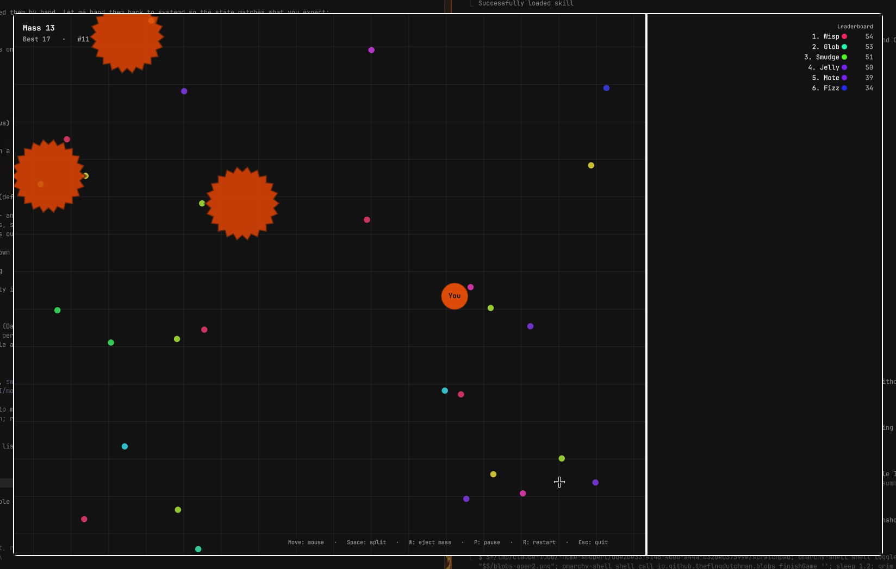

# Blobs

An offline, single-player take on the agar.io formula that runs inside the
Omarchy shell. Eat pellets, grow, swallow smaller blobs, avoid bigger ones,
and use split and eject to outsmart the bots. Everything happens locally in
QML; there is no network code and no external program is started.



## Play

Click the 󰊴 button in the bar, or bind a key to

```
omarchy-shell shell toggle io.github.theflngdutchman.blobs
```

| Input | Action |
|---|---|
| Mouse | Your blob follows the cursor |
| `Space` | Split every cell large enough (max 16 cells) |
| `W` | Eject a bit of mass towards the cursor |
| `P` / `Enter` | Pause and resume |
| `R` | Restart |
| `Esc` or click outside the arena | Quit |

Red spiky viruses pop any cell big enough to swallow them. Hide behind them
when you are small. Split cells merge back after roughly 30 seconds.

Your best score is stored in the plugin's own entry in
`~/.config/omarchy/shell.json`, next to the `bots` setting. The number of
bots (2–24) is configurable from the widget settings.

## Install

```
omarchy plugin add https://github.com/TheFlngDutchman/omarchy-blobs.git --enable
```

Without `--enable`, review the code first, then `omarchy plugin enable
io.github.theflngdutchman.blobs`. The button lands in the right section of the
bar; move it with `omarchy bar move`.

## Remove

```
omarchy plugin remove io.github.theflngdutchman.blobs
```

That deletes the plugin directory and its bar entry. Nothing else is written
to disk, so there is nothing else to clean up.

## Dependencies and privileges

- Omarchy 4.0.3 or newer (Quattro shell). No other dependencies.
- Uses only the QtQuick `Canvas` shipped with Qt and the scoped shell facade
  Omarchy hands every third-party plugin (`toggle`, `hide`,
  `updateEntryInline` for its own id).
- No `Process`, no `execDetached`, no network access, no file reads or
  writes, no bundled binaries, no privileges beyond the shell itself.

The game loop runs at ~60 Hz only while the overlay is open; the plugin is
idle otherwise.

## Development

```
omarchy plugin validate ~/.config/omarchy/plugins/io.github.theflngdutchman.blobs
qmllint -I /usr/share/omarchy/shell Overlay.qml BarWidget.qml
```

The overlay is `keepLoaded`, so changes to `Overlay.qml` or `Game.js` need
`omarchy restart shell`. Runtime errors show in
`qs -p /usr/share/omarchy/shell log`.

## License

MIT — see [LICENSE](LICENSE).
